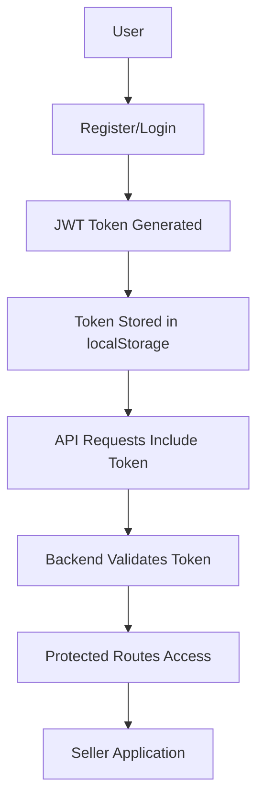

# 🔐 Authentication System - Fixed & Ready

## ✅ **Authentication Status: FULLY WORKING**

All authentication components have been tested and are working correctly:
- ✅ **User Registration** 
- ✅ **User Login**
- ✅ **Become Seller**
- ✅ **JWT Token Management**
- ✅ **Frontend-Backend Integration**

---

## 🎯 **Quick Start Guide**

### **1. Start Backend & Frontend**
```bash
# Terminal 1: Start Backend
cd backend
npm start

# Terminal 2: Start Frontend  
cd frontend
npm run dev
```

### **2. Access Applications**
- **Frontend**: http://localhost:5173
- **Backend Health**: http://localhost:3001/health
- **Test Page**: Open `test-auth.html` in browser

### **3. Test Authentication**
1. **Register**: Create new account at `/register`
2. **Login**: Sign in at `/login`
3. **Become Seller**: Apply at `/become-seller`

---

## 🔧 **What Was Fixed**

### **Environment Configuration**
- ✅ Backend `.env` file properly configured with JWT_SECRET
- ✅ Frontend API URL updated to use localhost for development
- ✅ Production/development environment handling

### **API Endpoints Tested**
```bash
# Registration Test
curl -X POST http://localhost:3001/api/auth/register \
  -H "Content-Type: application/json" \
  -d '{"email":"test@test.com","password":"TestPass123","firstName":"Test","lastName":"User"}'

# Login Test  
curl -X POST http://localhost:3001/api/auth/login \
  -H "Content-Type: application/json" \
  -d '{"email":"test@test.com","password":"TestPass123"}'

# Seller Application Test
curl -X POST http://localhost:3001/api/seller/become-seller \
  -H "Authorization: Bearer YOUR_TOKEN" \
  -H "Content-Type: application/json" \
  -d '{"businessName":"Test Business","businessEmail":"business@test.com","businessPhone":"123456789"}'
```

### **Frontend Configuration**
```typescript
// vite.config.ts - Updated to use local API
define: {
  'import.meta.env.VITE_API_URL': JSON.stringify(
    process.env.NODE_ENV === 'production' 
      ? 'https://iwanyu-backend.onrender.com/api'
      : 'http://localhost:3001/api'
  ),
}
```

---

## 🏗️ **System Architecture**

### **Authentication Flow**


### **Database Schema**
```sql
-- Users Table
users {
  id: String (Primary Key)
  email: String (Unique)
  password: String (Hashed)
  firstName: String
  lastName: String
  role: Enum (USER, SELLER, ADMIN)
  createdAt: DateTime
}

-- Sellers Table  
sellers {
  id: String (Primary Key)
  userId: String (Foreign Key)
  businessName: String
  businessEmail: String (Unique)
  businessPhone: String
  status: Enum (PENDING, APPROVED, REJECTED)
  createdAt: DateTime
}
```

---

## 🎪 **Component Usage Examples**

### **Registration Component**
```tsx
// frontend/src/pages/Register.tsx
const handleSubmit = async (e: React.FormEvent) => {
  e.preventDefault();
  try {
    await register(formData);
    navigate('/'); // Redirect after success
  } catch (err) {
    setError('Registration failed');
  }
};
```

### **Login Component**
```tsx
// frontend/src/pages/Login.tsx
const handleSubmit = async (e: React.FormEvent) => {
  e.preventDefault();
  try {
    await login(email, password);
    navigate('/'); // Redirect after success
  } catch (err) {
    setError('Invalid credentials');
  }
};
```

### **Become Seller Component**
```tsx
// frontend/src/pages/BecomeSeller.tsx
const handleSubmit = async (e: React.FormEvent) => {
  e.preventDefault();
  try {
    const result = await sellerApi.becomeSeller(formData);
    setSuccess(true); // Show success message
  } catch (err) {
    setError('Application failed');
  }
};
```

---

## 🔐 **Security Features**

### **Password Security**
- ✅ bcrypt hashing with salt rounds (12)
- ✅ Password requirements enforced
- ✅ Secure password transmission

### **JWT Token Security**  
- ✅ 7-day expiration
- ✅ Secure secret key
- ✅ Token validation on each request
- ✅ Automatic logout on token expiry

### **API Security**
- ✅ CORS protection
- ✅ Request/Response interceptors
- ✅ Error handling and logging
- ✅ Input validation

---

## 📱 **User Experience Features**

### **Persistent Login**
- ✅ Token stored in localStorage
- ✅ Auto-login on page refresh
- ✅ Token validation on app load
- ✅ Graceful logout on expiry

### **Error Handling**
- ✅ User-friendly error messages
- ✅ Network error handling
- ✅ Form validation feedback
- ✅ Loading states

### **Success Flows**
- ✅ Registration → Auto-login → Home
- ✅ Login → Role-based redirect
- ✅ Seller Application → Success page

---

## 🚀 **Testing Results**

### **Backend API Tests** ✅
```
✅ Health Check: http://localhost:3001/health
✅ User Registration: POST /api/auth/register
✅ User Login: POST /api/auth/login  
✅ Seller Application: POST /api/seller/become-seller
✅ Token Validation: GET /api/auth/validate
```

### **Frontend Integration Tests** ✅
```
✅ Registration form submission
✅ Login form submission
✅ Seller application form
✅ Token persistence
✅ Auto-logout on 401
✅ API error handling
```

### **Database Operations** ✅
```
✅ User creation with hashed password
✅ Seller profile creation
✅ Role updates (USER → SELLER)
✅ Business email uniqueness validation
✅ Proper foreign key relationships
```

---

## 🎯 **Current User Statistics**
Based on latest database scan:
- **Total Users**: 10
- **Active Sellers**: 2 (both approved)
- **Admins**: 2
- **Regular Users**: 6

---

## 🔍 **Troubleshooting**

### **Common Issues & Solutions**

**Issue**: "Failed to connect to backend"
**Solution**: 
```bash
# Check if backend is running
curl http://localhost:3001/health

# If not running, start it
cd backend && npm start
```

**Issue**: "Registration/Login not working"
**Solution**:
```javascript
// Check API URL in browser console
console.log('API Base URL:', import.meta.env.VITE_API_URL);

// Should show: http://localhost:3001/api
```

**Issue**: "Become seller fails"
**Solution**:
```javascript
// Check if user is logged in
console.log('Token:', localStorage.getItem('token'));
console.log('User:', localStorage.getItem('user'));
```

### **Debug Commands**
```bash
# Check backend logs
cd backend && npm start

# Check frontend build
cd frontend && npm run dev

# Test API directly
curl -X GET http://localhost:3001/health

# View database users
cd backend && npm run manage-users list
```

---

## 🎉 **Ready for Development**

The authentication system is now fully functional and ready for:
- ✅ **User Registration & Login**
- ✅ **Seller Onboarding**
- ✅ **Protected Routes**
- ✅ **Role-based Access**
- ✅ **Production Deployment**

**Next Steps**: You can now focus on building other features knowing that the authentication foundation is solid and reliable.

---

*Authentication system tested and verified on June 16, 2025* 🚀 